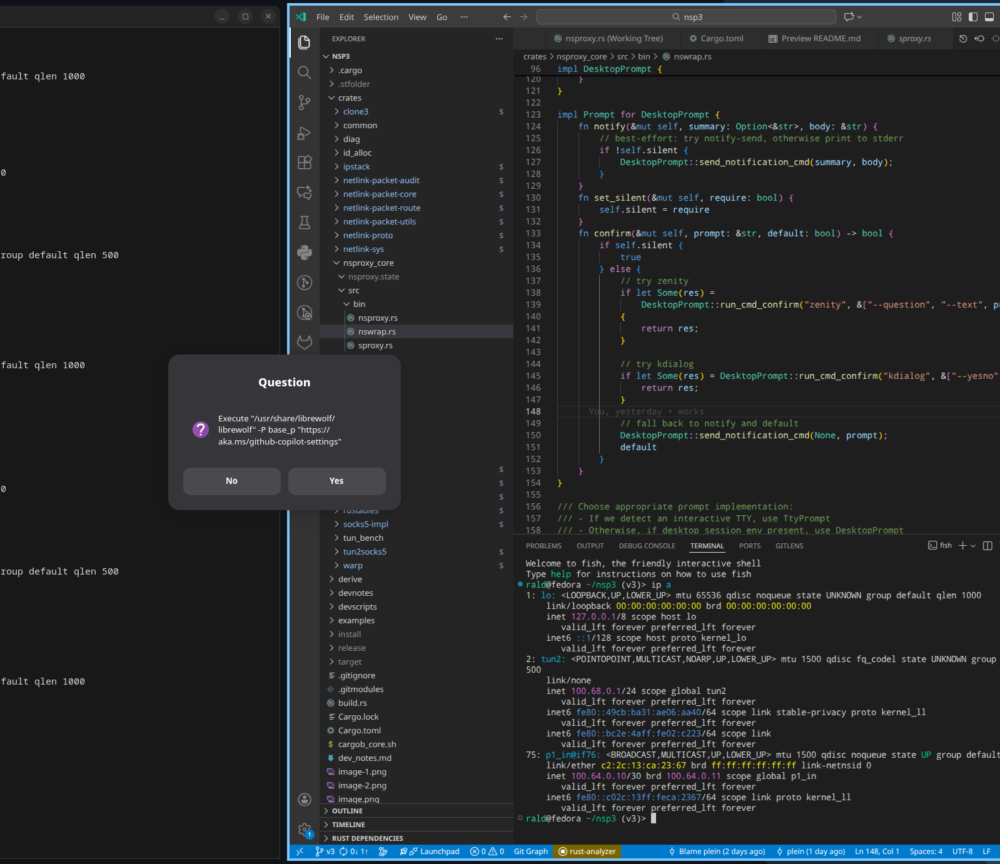
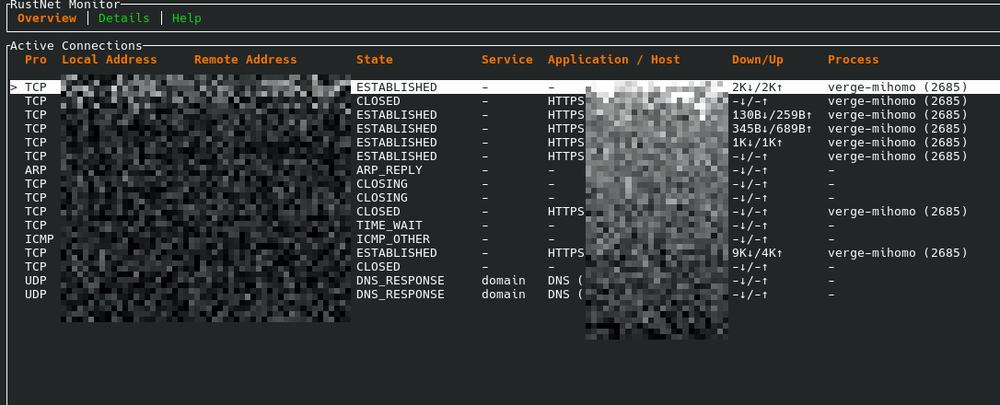
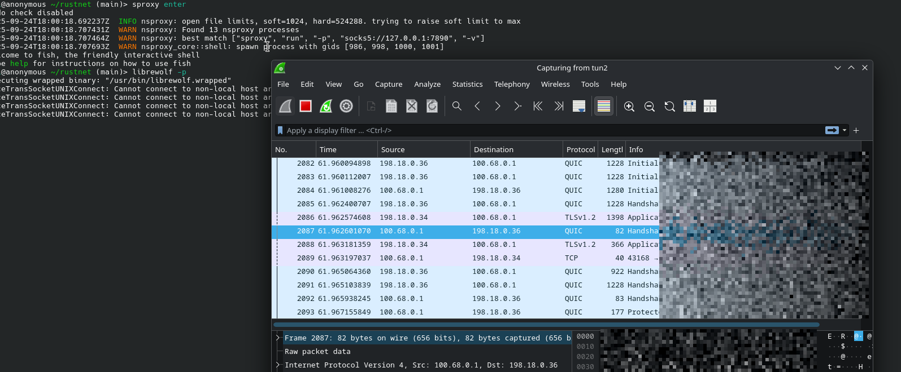
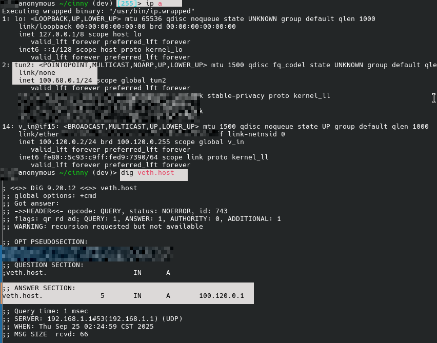
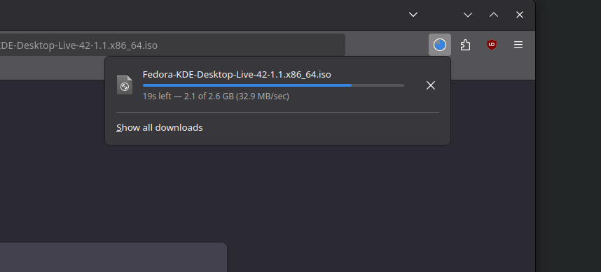

# _nsproxy_

It is

1. a compatbility layer from sockets to SOCKS
2. replacement for `sudo` when you work with network namespaces heavily
3. a handy tool to isolate traffic of select processes, where you can launch Wireshark inside to inspect the containerized traffic. 
4. a containerization-capable daemon for self-hosted web stacks, where you get virtual local domains assigned with zero setup
5. an extra layer to harden each Librewolf profile with privileged namespaces

It is an identity separation tool like Whonix for the paranoid, but much more practical and delightful to use. 

- Maximal compatiblity. Run system package managers, obscure softwares, arbitrary AppImages, proxied.
- Minimal trust. Softwares are no longer entrusted to use proxies and DNS properly. Nor should you assume it.
- High concurrency. Async TCP stack written in Rust, native, although the need for a 'compatibility layer' suggests there is something wrong already. 
- Maximal portability, minimal dependencies. Run nsproxy without desktop environment and chroot to rescue your system. 
- Non-sandbox. Not intended to be a sandbox. Ask flatpak to incorporate features in this project, if you want. 
- Not a new docker. This is a handy tool that follows the user loyally. 

## usage and compilation

`install_release.sh` should install an `opt=3` optimized version to your `/usr/local`

For releases, I use `release_upx.sh` which is a compressed `opt=3` binary.

## _nswrap_, securely contain links opened by Vscode

The security assumption is _faulty proxy handling but not malicious_, which happens to be the case for most applications and workflow. Nearly all programs can not pick up SOCKS5 environment variables, and even firefox leaked DNS. All of that would not happen in nsproxy.

Nsproxy isolates traffic of an entire process tree, as how kernel namespace is designed, in the same way Docker makes containers. Applications may escape the net-ns through dBus or various other IPC, systemd, etc. In cases such as browsers, nswrap handles the escape.




```sh
Usage: sproxy wrap [OPTIONS] --bin <BIN>

Options:
  -b, --bin <BIN>  The executable to hook
  -u, --undo       
  -h, --help       Print help
```

## minimal configuration state

No `/etc/`, `/usr/`, `$xdg`, and such hierarchy of fallbacks that serve no purpose but confusion. 

Nsproxy only takes command line arguments, one hot-reloaded config file, reads procfs and communicates with kernel through netlink.

## virtual DNS and files served through a TUN 

See `./nsproxy.json` which is similar to the configuration I use. The feature is particularly handy in cases of self-hosting.

```sh
# steps to start a local cinny instance in nsproxy container
sproxy enter
sudo setcap CAP_NET_BIND_SERVICE=+ep (realpath (which node)) # works on fish
npm i
npx vite build
npx vite preview --port 80
```

I run Cinny in an nsproxy container and direct virtual DNS to resolve multiple hosts to localhost, which enables me to use multiple accounts on Cinny.

Nsproxy can also serve static files directly through the TUN device.

## recommended practice for using with Clash

> Clash or other potentially untrusted proxies.

Clash ecosystem is fragmented and ill-audited, in direct contradiction with nsproxy's goals. Nsproxy would like a container's traffic to be completely proxied without any possibility of leaking. 

It's recommended to use [geph](http://geph.io/), and make sure to set it to `global` mode. Geph is written as a monolithic Rust project primarily led by a single developer who I admire to a degree, which places its security at levels way beyond, any solutions involving clash.

[Clash-rs](https://github.com/Watfaq/clash-rs) looks borderline acceptable, as, at least it built without nasty dependency problems when I cloned it. The code is subpar. 

If you use clash, double-check the outbound connections by running TLS-SNI capable packet sniffers. 

Sniffnet is __not__ TLS-SNI capable, as indicated by this [open issue](https://github.com/GyulyVGC/sniffnet/issues/944).

> So far Sniffnet has always retrieved domain names simply by performing reverse DNS lookups.

[Rustnet](https://github.com/domcyrus/rustnet) is recommended, as it does parse ClientHello. 

In case of Clash (or any proxy) leaking your traffic, either

- It dose unproxied, direct, visible DNS lookups which can be easily seen.
- It does lookups and still send TLS traffic unproxied, but we can do TLS-SNI inspection for that.

This is the best you can do and there is risk of deanonymization.  

Rustnet is truly handy in this case. 



Rustnet has added support for TUN. You can run rustnet in an nsproxy shell to monitor all connections.

You can do network monitoring involving QUIC with wireshark, in an nsproxy container.

```sh
sproxy enter -u 0 # finds an existing namespace and enters
wireshark
```



Doing analysis in a container is roughly the same as outside. 

### having the browser use SOCKS5 through a veth, or use TUN?



sproxy can connect a veth from a container, to your 'default namespace'. 

By default, `veth.host` and `veth.peer` are mapped to corresponding IP addresses through the virtual DNS mechanism.

The container above was created by 

```sh
sproxy run -p socks5://127.0.0.1:7770 -v 
# v for veths, p for proxy
```

You can re-enter this namespace by `sproxy enter`

`sproxy enter` traverses `/proc/` to find the namespaces that you might want to enter. 

From the perspective of less memory copying, you should set browser to use `veth.host`, as exposed by nsproxy, and have your proxy server listening at `veth.host`. 

## performance of the TUN userspace networking stack

1. Bandwidth



2. Concurrent connections

This measures its capability to _"accept"_ new connections, which is good enough for running `cargo build`s in nsproxy, various package managers, or regular web browsing, kicking off hundreds of connections per second.

But it's usually recommended to use the `veth.host` the Socks5 proxy directly, instead of routing through the TUN.

3. Virtual DNS

Sometimes the first DNS request fails, but it has been improved over the versions.

## Tor and other anonymity networks

Nsproxy works with Tor. 

## Docker, flatpak, various package managers

Currently flatpak installs with the command, so you can the `flatpak install` in the nsproxy shell to get proxied.

Docker installs images through the daemon. The quick fix is

```sh
sudo systemctl stop docker
sproxy enter
sudo dockerd
# This runs docker in the nsproxy which faciliates pulling images in a network-constrained environment but you can later just re-run in outside
```


## DNS

Socks5 is a protocol that establishes a bidirectional byte stream, when you connect to the TCP endpoint of a SOCKS server and supply a HOST in the handshake. The HOST can be either an IP address or a domain name. 

```

  -6, --ipv6-enabled
          IPv6 enabled

      --dns <strategy>
          DNS handling strategy

          Possible values:
          - over-tcp
          - direct
          - handled:  There is also a default value in clap
          
          [default: handled]

      --dns-addr <IP>
          DNS resolver address
          
          [default: 8.8.8.8]
```

In nsproxy, the handling of DNS is _explicitly_ outlined. In the `--dns handled` mode, as in, `handled by proxy server`, all connections are processed through a virtual DNS mechanism. The whole thing happens in the isolated network namespace. 

When DNS traffic arrives in the TUN interface, the request is responded with a virtual IP that will later be recombined with the supplied host name, to establish a new connection through the proxy server. 

```sh
app: request IPs for host example.com
nsproxy: A 198.18.0.2 # or such
app: TCP dial 198.18.0.2
nsproxy: CONNECT example.com 
    through the proxy as configured.
```

This is not necessarily the secure choice. 

Your proxy may resolve the name through conventional means, leaking DNS data. 

## IPv6

Many SOCKS5 proxies are not IPV6 capable, which breaks some websites.

Nsproxy does best effort to remove AAAA entries when you resolve DNS through a proxy. (SOCKS5 supports UDP)

## dev

Stop making modules private. Dependencies Shall hide nothing from me. 80% of forks in this project are due to some items being private.

Encapsulation is a failure, a failed feature coming from OOP.

### V3.2 Major fixes

- Nsproxy used to have problem with flatpak installs, due to implementation errors in TCP stack, the speed of download diminishes gradually until zero.
- V3.2 merged upstream ipstack implementation which increased performance drastically, overall

### V3.3 Major Fixes

- The virtual DNS by default only responds with a mapped virtual IPV6 address, which is hashed off the domain being requested. This sidesteps all the async/locking/ip-allocation problems with reasonable collision resistance. 