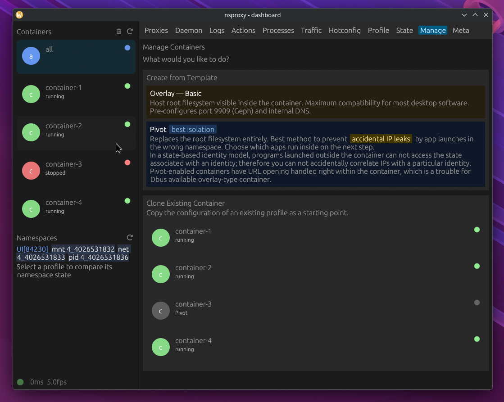
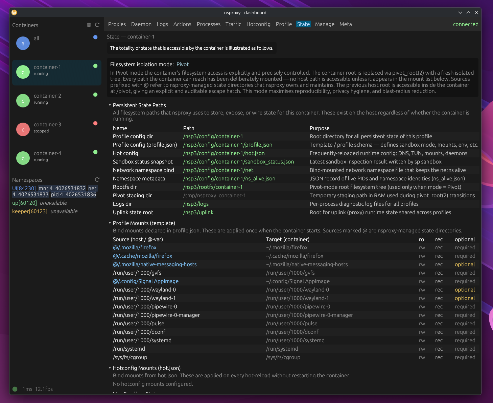
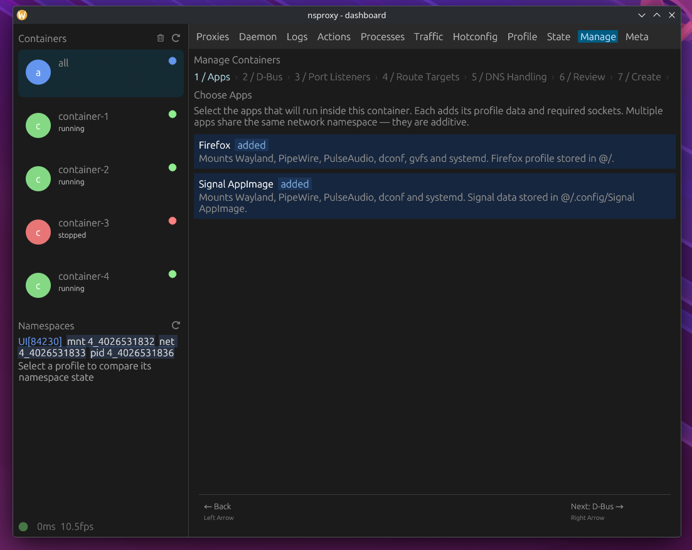
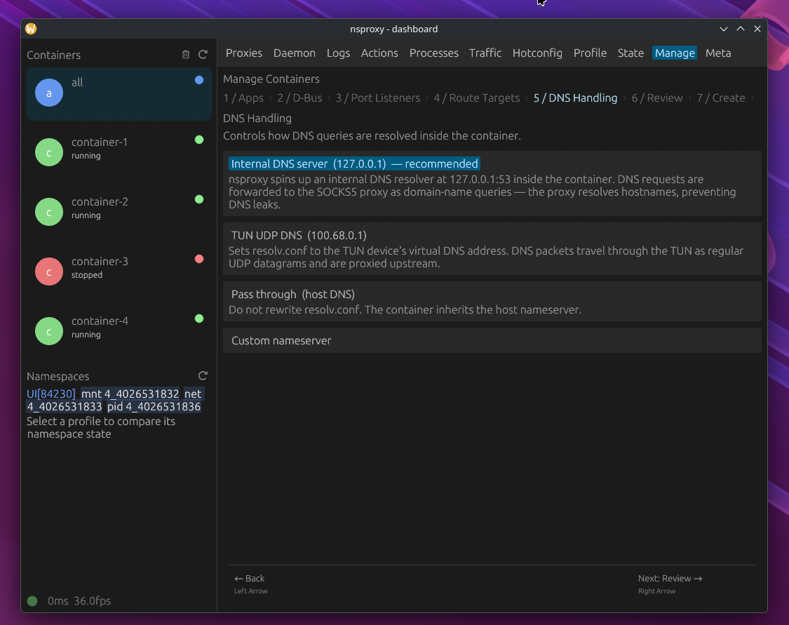
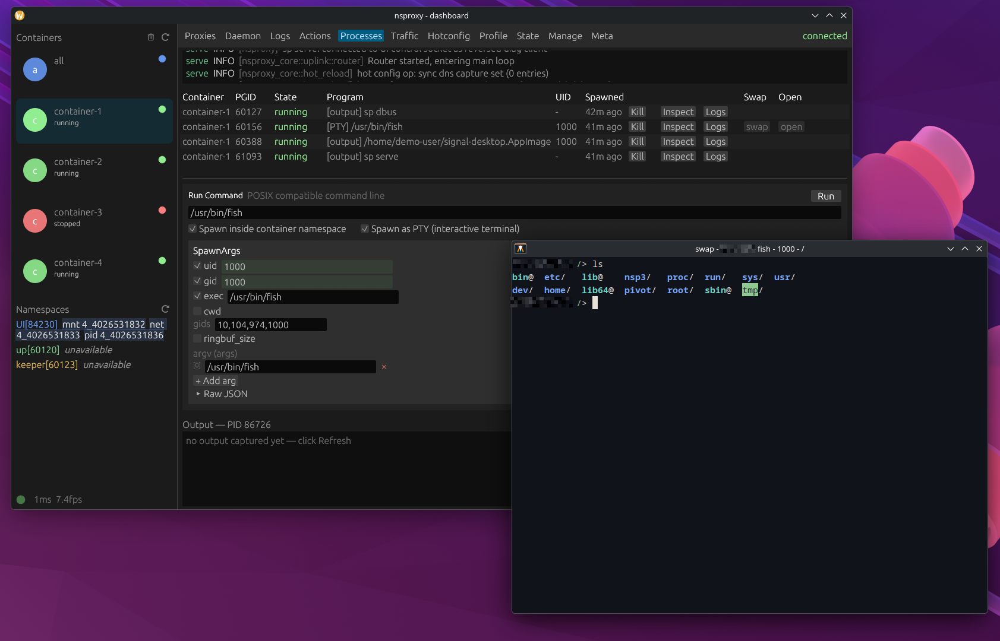

# Network-native containerization system

> nsproxy, network-namespace with SOCKS5 proxy

- You can run dockerd within a container, with everything proxied by a SOCK5 proxy
- The sandbox may defend against _casual_ attackers, or otherwise unnecessary state-cross-contamination of softwares
- The codebase is a singleton in full Rust. You are expected to modify the code. 
- Native [alacritty](https://github.com/alacritty/alacritty) integration at full speed
- It's shipped with a GUI written with EGUI, meant to daily-drive desktop with paranoia-level of network control
- You can control the degree of isolation. In the least isolated case, only network namespace is unshared, such that no softwares break.
- status, branch `main` is always production-ready
